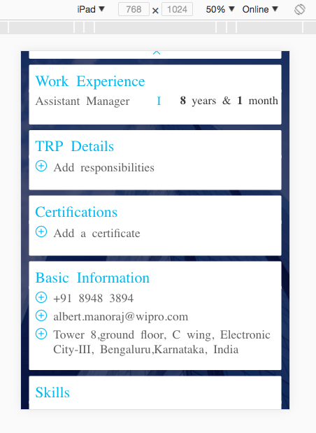
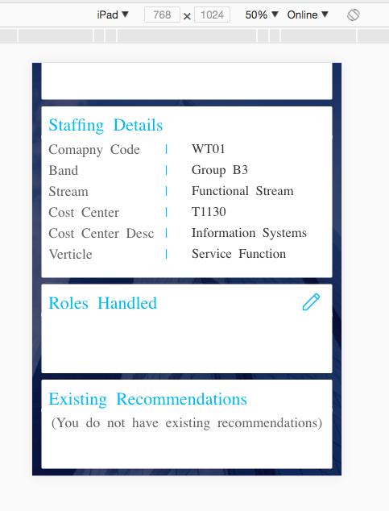
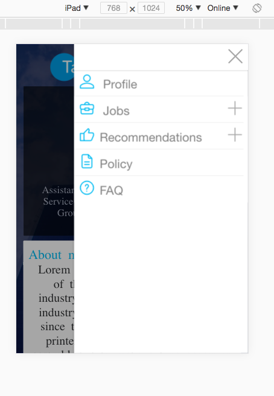
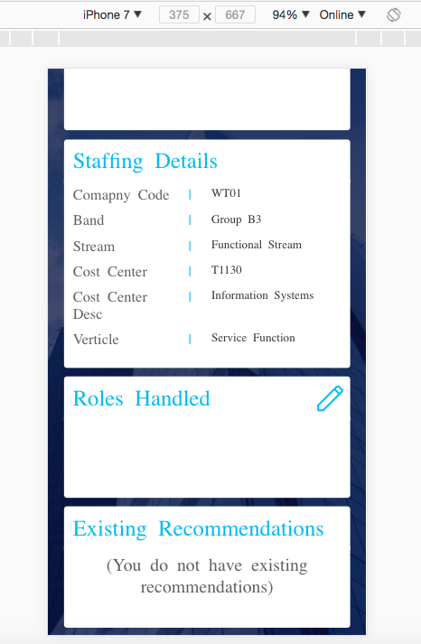
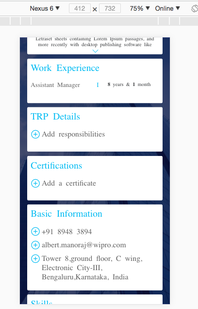
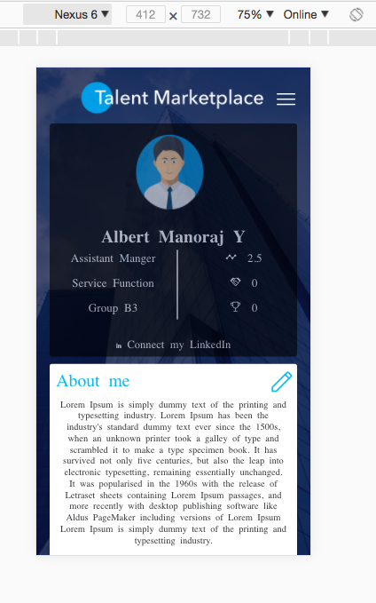
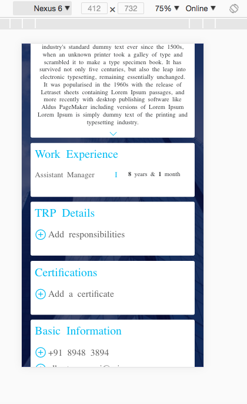
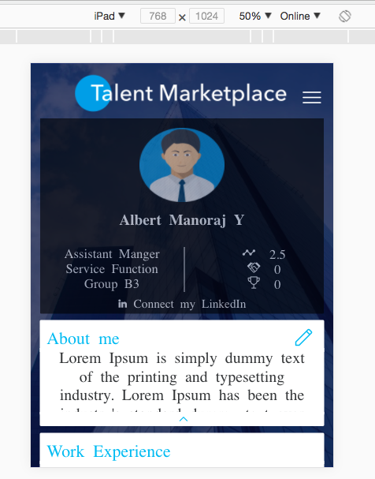

# Talent_Marketplace_Topcoder_Wipro
An ionic framework based frontend for Wipro's Talent Marketplace

# Instructions to RUN the code
1. Clone the repository or download the zip file and go inside it after extracting.
2. Open the installed directory in termninal.
3. RUN npm install
4. RUN ionic serve
5. go to http://localhost:8100/
6. Right Click on screen and select inspect element
7. Click on "toggle device toolbar" icon before "Elements" heading.
8. Select the device you want to view on from top-center dropdown of screen

# Requirements to run project.
1. Nodejs should be installed.
2. npm should be updated and working
3. Ionic3 CLI should be installed.

# Environment
1. Ionic CLI version 3.19.0
2. Node js version 6.11.0

# Screenshots on devices tested

  
  
  
  
  
  
  
  
  
  
  

# Devices Tested
1. Ipad
2. Ipad pro
3. iphone 7
4. iphone 7 plus
5. iphone 8 
6. iphone 8 plus
7. Galaxy note 2
8. Galaxy note 3
9. Blackberry Z30
10. Nexus 6
11. Nexus 6p
12. nexus 5x
13. galaxy s5
14. LG optimus L70
